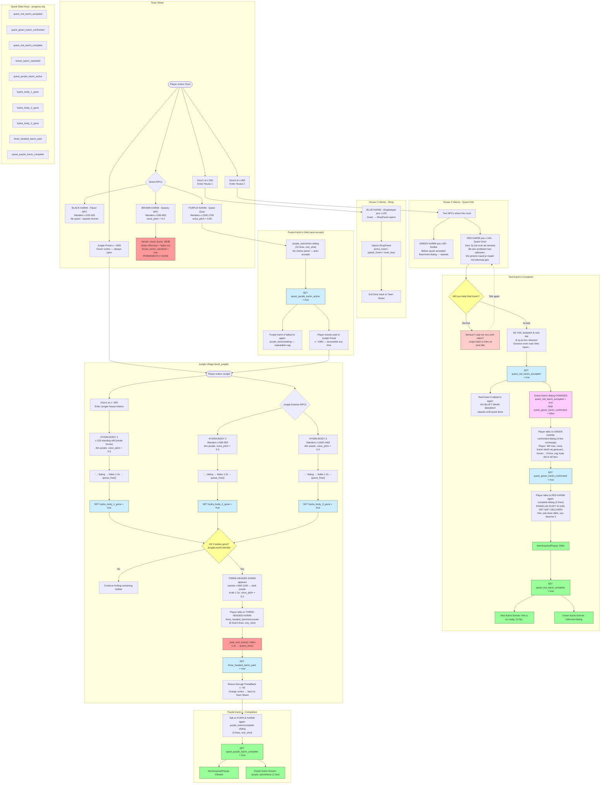

# Quest Flowchart — Town NPCs + Jungle Village

**Source of truth**: [`docs/quest-registry.md`](quest-registry.md) — all NPCs, quest steps, state keys, dialog IDs, and dependencies. Update that file first, then regenerate this diagram.

Copy only the content between the fences (starting at `flowchart TD`) into [mermaid.live](https://mermaid.live) to render and export as PNG.

