# Quest Flowchart

**Auto-generated** by `tools/quest_tool.py --graph --write`.
Do not edit by hand -- edit the JSON files in `godot_port/data/quests/` instead.
To re-render: copy the Mermaid block into [mermaid.live](https://mermaid.live).

```mermaid
flowchart TD

  subgraph EVENT_BROWN_KARI["Brown Karim Vanishes"]
    direction LR
    EVENT_BROWN_KARI_S([start])
    EVENT_BROWN_KARI_S -->|"brown_karim: spooky"| EVENT_BROWN_KARI_BROWN_KARIM_VANISHED("brown_karim_vanished")
  end

  subgraph QUEST_PURPLE_KAR["Purple Karim's Debt"]
    direction LR
    QUEST_PURPLE_KAR_S([start])
    QUEST_PURPLE_KAR_S -->|"choice: purple_karim: intro"| QUEST_PURPLE_KAR_QUEST_PURPLE_KARIM_ACTIVE("quest_purple_karim_active")
    QUEST_PURPLE_KAR_QUEST_PURPLE_KARIM_ACTIVE -->|"any order: hydra_body_1: dialog"| QUEST_PURPLE_KAR_HYDRA_BODY_1_GONE("hydra_body_1_gone")
    QUEST_PURPLE_KAR_HYDRA_BODY_1_GONE --> QUEST_PURPLE_KAR_HYDRA_BODIES_JOIN{all done?}
    QUEST_PURPLE_KAR_QUEST_PURPLE_KARIM_ACTIVE -->|"any order: hydra_body_2: dialog"| QUEST_PURPLE_KAR_HYDRA_BODY_2_GONE("hydra_body_2_gone")
    QUEST_PURPLE_KAR_HYDRA_BODY_2_GONE --> QUEST_PURPLE_KAR_HYDRA_BODIES_JOIN{all done?}
    QUEST_PURPLE_KAR_QUEST_PURPLE_KARIM_ACTIVE -->|"any order: hydra_body_3: dialog"| QUEST_PURPLE_KAR_HYDRA_BODY_3_GONE("hydra_body_3_gone")
    QUEST_PURPLE_KAR_HYDRA_BODY_3_GONE --> QUEST_PURPLE_KAR_HYDRA_BODIES_JOIN{all done?}
    QUEST_PURPLE_KAR_HYDRA_BODIES_JOIN -->|"three_headed_karim: encounter"| QUEST_PURPLE_KAR_THREE_HEADED_KARIM_PAID("three_headed_karim_paid")
    QUEST_PURPLE_KAR_THREE_HEADED_KARIM_PAID -->|"purple_karim: complete"| QUEST_PURPLE_KAR_QUEST_PURPLE_KARIM_COMPLETE("quest_purple_karim_complete")
    QUEST_PURPLE_KAR_QUEST_PURPLE_KARIM_COMPLETE --> QUEST_PURPLE_KAR_REWARD(["reward: Vibrator"])
  end

  subgraph QUEST_RED_KARIM["Red Karim's Problem"]
    direction LR
    QUEST_RED_KARIM_S([start])
    QUEST_RED_KARIM_S -->|"choice: red_karim: intro"| QUEST_RED_KARIM_QUEST_RED_KARIM_ACCEPTED("quest_red_karim_accepted")
    QUEST_RED_KARIM_QUEST_RED_KARIM_ACCEPTED -->|"green_karim: confronted"| QUEST_RED_KARIM_QUEST_GREEN_KARIM_CONFRONTED("quest_green_karim_confronted")
    QUEST_RED_KARIM_QUEST_GREEN_KARIM_CONFRONTED -->|"red_karim: complete"| QUEST_RED_KARIM_QUEST_RED_KARIM_COMPLETE("quest_red_karim_complete")
    QUEST_RED_KARIM_QUEST_RED_KARIM_COMPLETE --> QUEST_RED_KARIM_REWARD(["reward: Dildo"])
  end
```

<!-- AUTO-GENERATED by tools/quest_tool.py -- do not edit by hand -->
<!-- Run: python tools/quest_tool.py --graph --write -->

